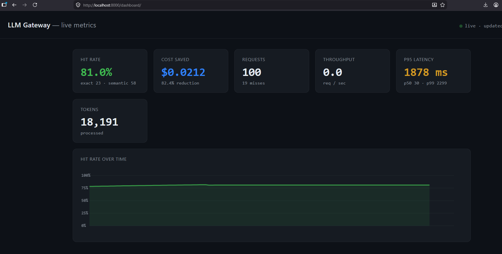

# LLM Gateway

A proxy that sits between your app and an LLM provider like OpenAI. You point your
client at this instead of the provider and it forwards the request. On top of that it
caches responses (both identical and *similar* prompts) so repeated calls are served
instantly and for free, and it tracks cost so you can see what the cache saves.

All five phases are done: transparent proxy, exact + semantic caching, rate limiting + failover, and observability with a live dashboard and benchmark.

## Live demo

**https://llm-gateway-hh2p.onrender.com/**

Try it with the public demo key below. This key only reaches the **mock** provider and is rate-limited, so it's safe to share — real provider keys are never committed and load from environment variables.

```bash
curl -i https://llm-gateway-hh2p.onrender.com/v1/chat/completions \
  -H "Authorization: Bearer llm_demo_777" \
  -H "Content-Type: application/json" \
  -d '{"model":"gpt-4o-mini","messages":[{"role":"user","content":"What is the capital of France?"}]}'
```

Run it twice and watch the second response return `X-Cache: HIT-EXACT`. Semantic caching is disabled in the hosted demo (it needs ~1 GB RAM for the local embedding model); [run it locally](#running-it) to see paraphrases hit the cache too.

## What's here so far

- `POST /v1/chat/completions` in the normal OpenAI format
- mock / openai / anthropic providers (all normalized to the OpenAI shape)
- streaming works (`"stream": true`)
- **exact cache** (Redis) — identical prompts served in single-digit ms
- **semantic cache** (pgvector) — paraphrases hit too, e.g. "Tell me France's capital"
  matches "What's the capital of France?"
- **rate limiting** — per-key token bucket, atomic in Redis, 429 + `Retry-After`
- **failover** — retry with backoff, then fall back to a second provider
- cost metering + `/stats` (hit rate, cost saved vs spent, tokens)
- `X-Cache`, `X-Cache-Similarity`, `X-Cost-Saved-USD`, `X-RateLimit-Remaining`
- **observability** — Prometheus `/metrics`, a live `/dashboard`, and a benchmark harness
- bearer key auth
- Docker + compose (gateway + redis + postgres/pgvector, optional prometheus + grafana)

## Running it

Needs Docker. Copy the env file and bring it all up:

```bash
cp .env.example .env
docker compose up --build
```

Gateway is on http://localhost:8000; Redis and Postgres come up alongside it. The
default provider is the mock one, so no API key is needed. (The first request that uses
the semantic cache loads the embedding model, which can take a few seconds the first time.)

Exact cache — send the same message twice:

```bash
curl -i http://localhost:8000/v1/chat/completions \
  -H "Authorization: Bearer gw_sk_demo123" -H "Content-Type: application/json" \
  -d '{"model":"gpt-4o-mini","messages":[{"role":"user","content":"What is the capital of France?"}]}'
# repeat -> X-Cache: HIT-EXACT
```

Semantic cache — now ask the same thing a different way:

```bash
curl -i http://localhost:8000/v1/chat/completions \
  -H "Authorization: Bearer gw_sk_demo123" -H "Content-Type: application/json" \
  -d '{"model":"gpt-4o-mini","messages":[{"role":"user","content":"Tell me France'\''s capital"}]}'
# -> X-Cache: HIT-SEMANTIC, plus X-Cache-Similarity
```

Check the running totals:

```bash
curl http://localhost:8000/stats
```

## Using it from the OpenAI SDK

You only change the base url:

```python
from openai import OpenAI

client = OpenAI(base_url="http://localhost:8000/v1", api_key="gw_sk_demo123")
r = client.chat.completions.create(
    model="gpt-4o-mini",
    messages=[{"role": "user", "content": "hello"}],
)
print(r.choices[0].message.content)
```

To hit the real OpenAI instead of the mock, set in `.env`:

```bash
PRIMARY_PROVIDER=openai
OPENAI_API_KEY=sk-...
```

## Tuning the semantic cache

`SIMILARITY_THRESHOLD` (default 0.92) controls how close a paraphrase must be to count as a
hit. Lower = more hits but more risk of a wrong answer; higher = safer but fewer hits. Every
lookup logs its best similarity so you can pick a value from real traffic.

## Rate limiting and failover

Each API key gets a token bucket (default: 60 burst, 1/sec sustained). Burst past it and you
get a `429` with `Retry-After`. Tune with `RATE_LIMIT_CAPACITY` / `RATE_LIMIT_REFILL_PER_SEC`,
or turn it off with `RATE_LIMIT_ENABLED=false`.

Set a `FALLBACK_PROVIDER` to enable failover: if the primary errors or times out, the request
is retried with backoff and then sent to the fallback (which can be a different vendor, since
responses are normalized to the OpenAI shape). The `X-Provider` header shows which one served.

```bash
PRIMARY_PROVIDER=openai
FALLBACK_PROVIDER=anthropic
OPENAI_API_KEY=sk-...
ANTHROPIC_API_KEY=sk-ant-...
```

## Live dashboard

Once it's running, open <http://localhost:8000/dashboard/> for a live view (hit rate, cost
saved, RPS, p95 latency) that updates every 2 seconds. `/metrics` exposes the same data in
Prometheus format for Grafana.

## Benchmark

The benchmark drives a realistic mix (40% exact repeats, 20% paraphrases, 40% unique) so it
exercises both cache tiers like real traffic. Give the mock provider a fake delay so the
cached-vs-uncached contrast is visible, then run it:

```bash
# in docker-compose.yml, set MOCK_LATENCY_MS: "600" on the gateway, then:
docker compose up --build

# in another terminal (with the .venv active for httpx):
python benchmark/run.py --n 300 --concurrency 10
```

It prints hit rate, the latency split (hit vs miss), cost reduction, and the 429 count from a
burst phase. Open the dashboard while it runs to watch the numbers move.

## Results

Fill this in with your own run (the numbers below are placeholders):

| Config | Hit rate | Cost reduction | p95 (hit / miss) |
|--------|---------:|---------------:|-----------------:|
| Cache off | 0% | 0% | ~600 ms |
| Exact only | … | … | … |
| Exact + semantic | … | … | ~5 ms / ~600 ms |

## Running without Docker

You'll want Redis and Postgres (with pgvector) available, but the gateway degrades
gracefully if they're not — caches just turn into misses and it still proxies.

```bash
python3 -m venv .venv && source .venv/bin/activate
pip install -r requirements.txt    # note: pulls torch for local embeddings (heavy)
cp .env.example .env
uvicorn app.main:app --reload
```

## Tests

```bash
pytest -q
```

Tests use an in-memory fake Redis and skip the database tier, so no servers (and no model
download) are needed to run them.

## Layout

```
app/
  main.py            app + health/root, mounts routes, runs the schema migration
  config.py          settings from env
  models.py          request schema
  deps.py            shared redis client
  db.py              postgres/pgvector pool + migration
  api/chat.py        /v1/chat/completions (exact -> semantic -> provider, write-through)
  api/stats.py       /stats
  auth/              bearer key check
  cache/             keys.py, exact.py (Redis), embeddings.py, semantic.py (pgvector)
  metering/          pricing.py, cost.py, usage.py (redis counters)
  providers/         mock, openai, anthropic, and the router (retry + failover)
  ratelimit/         token_bucket.lua + limiter.py (atomic token bucket)
  metrics.py         prometheus counters + latency histogram
  middleware.py      ASGI latency middleware
  api/metrics.py     /metrics (prometheus)
db/init.sql          pgvector extension + tables
dashboard/           live metrics dashboard (static)
benchmark/run.py     load + workload harness
monitoring/          prometheus scrape config
tests/
images/              placeholder for all images
```

## Benchmark results

Run against **Google Gemini** (`gemini` via the OpenAI-compatible endpoint) with a
realistic workload of 100 requests (40% exact repeats, 20% paraphrases, 40% unique),
at concurrency 1:

| Metric | Result |
|---|---|
| Cache hit rate | **81%** (23 exact, 58 semantic) |
| Cost reduction | **82.4%** ($0.0212 saved vs $0.0045 spent) |
| p95 latency — cache hit | **44.5 ms** |
| p95 latency — cache miss | **2381.7 ms** |

Latency by path (p50 / p95 / p99):

| Path | Count | p50 | p95 | p99 |
|---|--:|--:|--:|--:|
| Cache HIT (all) | 81 | 34.9 ms | 44.5 ms | 50.3 ms |
| &nbsp;&nbsp;exact | 23 | 10.3 ms | 11.6 ms | 12.8 ms |
| &nbsp;&nbsp;semantic | 58 | 37.3 ms | 45.0 ms | 50.3 ms |
| Cache MISS | 19 | 1434.3 ms | 2381.7 ms | 2978.3 ms |

The semantic tier did most of the work here (58 of 81 hits came from paraphrased prompts,
not exact repeats), and a cache hit returned **~50× faster** than a miss to the live model.

### Live dashboard



